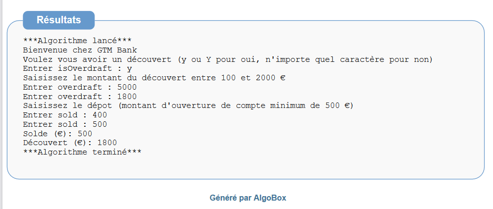

# TP Validation des acquis HTML/CSS/JS/UML/SQL/GIT

---

## Objectif du TP 

Répondre à un problème métier en utilisant toutes les connaissances vues dans le cadre de votre formation.

---

## Travaux à effectuer

1. Versionnez le TP avec Git et GitHub.
2. Utilisez le diagramme de classe pour modéliser les concepts de votre système.
3. Transformez votre diagramme de classe en modèle relationnel.
4. Créez votre base de données avec les tables à partir de votre modèle relationnel.
5. Créez une single Page pour répondre aux besoins exprimés.
- Effectuez une mise en page en FlexBox et les positions pour vos pages web ;
- Le menu doit rester visible lorsqu'on scrolle la page ;
- Validez votre CSS et HTML à l'aide des validateurs ci-après.
6. Intégrez du JavaScript pour dynamiser vos pages web cf. [vidéo des intéractions](./src/video/actions.mp4)

Les détails des travaux ci-après.

### Validation du code statique HTML et CSS

- [HTML Validation](https://validator.w3.org/#validate_by_input)
- [CSS Validation](https://jigsaw.w3.org/css-validator/#validate_by_input)

### Conseils

- RESTEZ FOCUS sur les besoins exprimés, attention à ne pas trop s'éloigner du périmètre fonctionnel en ajoutant des nouvelles fonctionnalités.
- Ne perdez pas du temps sur l'ajout des élements graphiques supplémentaires tels que les icônes, couleurs, fonts, concentrez-vous sur le fond (les besoins).
- Pour la modélisation, si vous n'êtes pas à l'aise avec les outils, utilisez une feuille et un crayon.
- Time-boxé (accordez-vous un temps maximal) pour réaliser une tâche et réunissez-vous 5 à 10 min pour faire le point afin de se synchroniser, détecter des obstacles ou difficultés pour vous permettre de vous réorganiser ou d'adapter votre plan d'action.
---

## Ressources

### Graphiques

- La [charte graphique](./src/charte.md) fournie par l'équipe Design de GTM Bank.

### Techniques

- [Modal](https://www.w3schools.com/howto/howto_css_modals.asp)
- En js pour obtenir la valeur d'une propriété CSS `const bgColor = getComputedStyle(document.querySelector('body')).getPropertyValue("background-color");`
- [Effet zoom](https://www.w3schools.com/cssref/css_pr_scale.php)
- [Les transitions pour avoir des changements de valeur plus fluide et moins brusque](https://www.w3schools.com/css/css3_transitions.asp)
---

## Besoins exprimés par le client

- Vous êtes une équipe de 4 développeurs et vous travaillez pour une nouvelle banque en ligne la GTM Bank.
- GTM Bank souhaite créer un site web permettant d'effectuer des opérations bancaires d'usage.
- Certains clients auront droit à un découvert, cependant la banque applique des pénalités lorsque le client utilise une partie ou l'intégralité de son découvert autorisé.
- Une fois le montant crédité sur le compte, le client, peut effectuer autant de retrait qu'il souhaite jusqu'à l'épuisement de son solde ou de l'utilisation totale de son découvert.
- Le retrait est autorisé uniquement lorsque le solde est suffisant.
 - Si le client n'a pas opté pour le découvert, le nouveau solde ne doit pas être négatif.
 - Si le client a opté pour le découvert, le nouveau solde ne doit pas dépasser le montant du découvert autorisé.
- Le montant du découvert est toujours positif.
- Le montant du retrait est toujours positif et d'un montant minimum d'un euro.

---

## Travaux en équipe

Organisation et logiciels libres.

Voici les missions de l'équipe : 
1. Mettre en place un dépôt GitHub en invitant les membres du groupe et le formateur ***contact@tshimini.fr***.
2. Réalisez le diagramme de classes pour la future base de données.
3. Transformez le diagramme de classes en modèle relationnel.
4. Créez votre base de données dans le SGBDR de votre choix (SQLite, MySQL ou MariaDB).

Ensuite, attribuez-vous les tâches individuellement ou en binôme. Vous devez être capable de travailler individuellement ou en binôme sur une tâche tout en travaillant conjointement avec le reste de l'équipe.
- Le premier développeur ou binôme est responsable de l'ouverture de compte.
- Le second ou binôme des opérations de retrait.
- Le dernier du calcul des agios.

---

### Mission individuelle du développeur 1 ou binôme : ouverture du compte

Écrivez un algorithme qui demande au client lors de la création d'un nouveau compte bancaire chez `GTM Bank` :
1. La possibilité d'avoir recours au découvert (oui ou non) ;
 - Si oui, le montant du découvert autorisé entre 100 et 2000 €, le client détermine ce montant en fonction de ses besoins
2. Le montant à transférer pour l'ouverture du compte, la somme initiale doit être au minimum de 500 € ;
3. Forcez le client à respecter les conditions (montant du départ et la fourchette du découvert).

Pour résumé :
- Demandez au client s'il souhaite avoir droit au découvert ;
 - Si oui, demandez au client le montant du découvert (valeur comprise entre 100 et 2000 €).
- Demandez au client le montant à transférer sur le compte (>= 500€) pour l'ouverture du compte ;
- En sortie, votre algorithme affiche la somme initiale et le montant du découvert (zéro s'il n'a pas opté pour le découvert).

##### Illustrations du résultat de l'algorithme

---

### Mission individuelle du développeur 2  ou binôme : retraits

Écrivez un algorithme qui prend en entrée :

1. Le montant de son découvert autorisé (si le client n'a pas choisi d'avoir droit au découvert, il doit saisir zéro) ;
2. Le solde du compte en cours ;
3. Le montant du retrait souhaité par le client.

Attention le montant du solde s'il est négatif ne doit pas être supérieur en valeur absolue au montant du découvert.

Exemple : 

- Non autorisé, découvert de 500 € et solde de -700 € ;
- Autorisées, découvert de 500 € et solde de -500 € ou découvert de 900 € et solde de -300 €.

Tant que le solde est suffisant, votre programme doit redemander au client s'il souhaite refaire un nouveau retrait.

Le client peut arrêter les opérations en saisissant la valeur 0 (ou un autre caractère alphanumérique).

En sortie, votre algorithme affiche :

1. Le nouveau solde ou un message "solde insuffisant" ;
2. Le montant du découvert.

Pour résumé : 

- Demandez le montant du découvert (0 s'il n'y a pas découvert autorisé) ;
- Demandez le solde en cours ;
- Tant que le solde le permet, demandez au client s'il souhaite effectuer un autre retrait. Il saisira la valeur du retrait ou 0 pour quitter ;
- Affichez le nouveau solde et le montant du découvert ou "solde insuffisant".

##### Illustrations du résultat de l'algorithme

---

### Mission individuelle du développeur 3 : agios

Écrivez un algorithme qui calcule les agios avec un taux de 10% pour un découvert utilisé durant X jours.

Par exemple, j'ai utilisé 500 euros de mon découvert autorisé durant 15 jours, j'aurai une pénalité à payer à la banque de 2.05 € qui correspond à l'opération suivante : `(500 * 15 *(10/100)) / 365` <=> `500 * 15 * 0.1 / 365`.

En entrée, votre algorithme prend :

1. Le montant du découvert ;
2. Durée d'utilisation du découvert (en jour).

En sortie, votre algorithme affiche la somme que le client devra payer à la banque **arrondie à 2 chiffres après la virgule.**

Votre algorithme s'arrête immédiatement lorsque le client n'a pas droit au découvert (montant du découvert égale à zéro), affichez le message "Découvert non autorisé => pas d'agios".
Forcez le client à saisir les bonnes valeurs :
- Montant du découvert compris entre 100 € et 2000 € ou égale à zéro lorsqu'il n'a pas droit au découvert ;
- Le nombre de jours compris entre 1 et 365.

#### Formulaire pour calculer d'agios

`Agios = (montant utilisé du découvert * nombre de jours d'utilisation * taux de la banque) / 365`
`Le taux de banque = 10 / 100 = 0.1`

#### Outils en ligne pour vérifier le résultat de votre calcul

[Calcul agios](https://www.coover.fr/outils/calcul-agios).

##### Illustrations du résultat de l'algorithme

